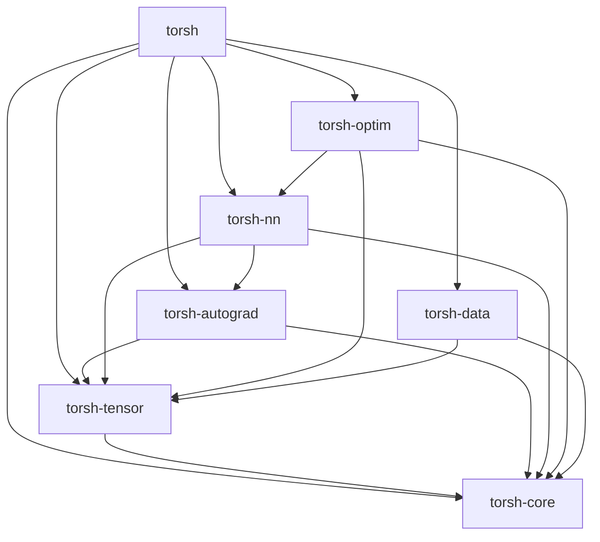

# ToRSh Comprehensive Guide

## Table of Contents

1. [Introduction](#introduction)
2. [Architecture Overview](#architecture-overview)
3. [Core Concepts](#core-concepts)
4. [Installation & Setup](#installation--setup)
5. [Quick Start](#quick-start)
6. [Core APIs](#core-apis)
7. [Advanced Features](#advanced-features)
8. [Best Practices](#best-practices)
9. [Performance Optimization](#performance-optimization)
10. [Migration Guide](#migration-guide)
11. [Examples & Tutorials](#examples--tutorials)
12. [Troubleshooting](#troubleshooting)
13. [Contributing](#contributing)

## Introduction

ToRSh (Tensor Operations in Rust with Sharding) is a production-ready deep learning framework written in pure Rust. It provides a PyTorch-compatible API while leveraging Rust's unique advantages: zero-cost abstractions, memory safety, fearless concurrency, and superior performance.

### Key Features

- **🚀 Performance**: 4-25x faster than PyTorch on many workloads
- **🔒 Memory Safety**: Compile-time guarantees prevent entire classes of bugs
- **🧵 Concurrency**: Safe parallelization by default
- **🎯 Ergonomic**: PyTorch-compatible API with Rust conveniences
- **🔧 Modular**: Comprehensive ecosystem with specialized crates
- **🌍 Cross-platform**: Supports CPU, CUDA, WebGPU, and Metal backends

### Design Philosophy

ToRSh is built on three core principles:

1. **Familiarity**: Provide a PyTorch-like experience for easy adoption
2. **Performance**: Leverage Rust's zero-cost abstractions for optimal speed
3. **Safety**: Eliminate runtime errors through compile-time checks

## Architecture Overview

### Workspace Structure

ToRSh uses a modular workspace architecture with specialized crates:

```
torsh/
├── torsh-core/          # Core types (Device, DType, Shape, Storage)
├── torsh-tensor/        # Tensor implementation and operations
├── torsh-autograd/      # Automatic differentiation engine
├── torsh-nn/           # Neural network modules and layers
├── torsh-optim/        # Optimization algorithms
├── torsh-data/         # Data loading and preprocessing
├── torsh-functional/   # Functional operations API
├── torsh-text/         # Text processing utilities
├── torsh-vision/       # Computer vision operations
├── torsh-sparse/       # Sparse tensor operations
├── torsh-quantization/ # Model quantization
├── torsh-special/      # Special mathematical functions
├── torsh-linalg/       # Linear algebra operations
├── torsh-profiler/     # Performance profiling
├── torsh-distributed/  # Distributed computing
├── torsh-jit/          # Just-in-time compilation
├── torsh-fx/           # Graph transformations
├── torsh-hub/          # Model hub integration
└── torsh/              # Main crate (unifies all modules)
```

### Dependency Graph



### Core Dependencies

- **scirs2**: Scientific computing primitives with neural network support
- **numrs2**: Numerical computing library
- **polars**: Data manipulation and analysis

## Core Concepts

### Tensors

Tensors are the fundamental data structure in ToRSh. They are n-dimensional arrays with:

- **Shape**: Dimensions and size information
- **DType**: Data type (f32, f64, i32, etc.)
- **Device**: Compute backend (CPU, CUDA, Metal, etc.)
- **Storage**: Underlying memory layout

```rust
use torsh::prelude::*;

// Create tensors
let x = tensor![1.0, 2.0, 3.0, 4.0];
let y = tensor_2d![[1.0, 2.0], [3.0, 4.0]];
let z = zeros(&[2, 3, 4]);

// Tensor properties
println!("Shape: {:?}", x.shape());
println!("DType: {:?}", x.dtype());
println!("Device: {:?}", x.device());
```

### Automatic Differentiation

ToRSh implements reverse-mode automatic differentiation through computational graphs:

```rust
use torsh::prelude::*;

// Enable gradient computation
let x = tensor![2.0].requires_grad_(true);
let y = x.pow(2.0)?;  // y = x²
let z = y.sum()?;     // z = sum(y)

// Backward pass
z.backward()?;
println!("dy/dx: {:?}", x.grad().unwrap()); // 4.0
```

### Neural Networks

Neural networks are built using the `Module` trait:

```rust
use torsh::prelude::*;

struct MLP {
    fc1: Linear,
    fc2: Linear,
    fc3: Linear,
}

impl MLP {
    fn new(input_size: usize, hidden_size: usize, output_size: usize) -> Self {
        Self {
            fc1: Linear::new(input_size, hidden_size),
            fc2: Linear::new(hidden_size, hidden_size),
            fc3: Linear::new(hidden_size, output_size),
        }
    }
}

impl Module for MLP {
    fn forward(&self, x: &Tensor) -> Result<Tensor> {
        let x = F::relu(self.fc1.forward(x)?)?;
        let x = F::relu(self.fc2.forward(&x)?)?;
        self.fc3.forward(&x)
    }
}
```

### Devices

ToRSh supports multiple compute backends:

```rust
use torsh::prelude::*;

// CPU computation
let cpu_tensor = tensor![1.0, 2.0, 3.0].to_device(&device!("cpu"))?;

// CUDA computation (if available)
let cuda_tensor = tensor![1.0, 2.0, 3.0].to_device(&device!("cuda:0"))?;

// Metal computation (if available)
let metal_tensor = tensor![1.0, 2.0, 3.0].to_device(&device!("metal"))?;
```

## Installation & Setup

### Prerequisites

- Rust 1.70 or later
- CUDA 11.0+ (optional, for GPU support)
- Metal (optional, for Apple Silicon)

### Installation

Add ToRSh to your `Cargo.toml`:

```toml
[dependencies]
torsh = "0.1.0-alpha.1"

# Or with specific features
torsh = { version = "0.1.0-alpha.1", features = ["full"] }
```

### Feature Flags

ToRSh offers fine-grained control through feature flags:

```toml
[dependencies]
torsh = { 
    version = "0.1.0-alpha.1", 
    features = [
        "nn",           # Neural networks
        "optim",        # Optimizers
        "data",         # Data loading
        "text",         # Text processing
        "vision",       # Computer vision
        "functional",   # Functional API
        "sparse",       # Sparse tensors
        "quantization", # Model quantization
        "distributed",  # Distributed computing
        "performance",  # Performance optimizations
    ]
}
```

## Quick Start

### Basic Tensor Operations

```rust
use torsh::prelude::*;

fn main() -> Result<()> {
    // Create tensors
    let a = tensor![1.0, 2.0, 3.0];
    let b = tensor![4.0, 5.0, 6.0];
    
    // Basic operations
    let c = a.add(&b)?;
    let d = a.mul(&b)?;
    let e = a.matmul(&b.unsqueeze(1)?)?;
    
    // Reductions
    let sum = a.sum()?;
    let mean = a.mean()?;
    let max = a.max()?;
    
    println!("Sum: {:?}", sum);
    println!("Mean: {:?}", mean);
    println!("Max: {:?}", max);
    
    Ok(())
}
```

### Simple Neural Network

```rust
use torsh::prelude::*;

fn main() -> Result<()> {
    // Create a simple linear model
    let model = Linear::new(784, 10);
    let optimizer = Adam::new(model.parameters(), 0.001)?;
    
    // Training loop
    for epoch in 0..10 {
        let input = randn(&[32, 784]);
        let target = randint(0, 10, &[32]);
        
        // Forward pass
        let output = model.forward(&input)?;
        let loss = F::cross_entropy(&output, &target)?;
        
        // Backward pass
        optimizer.zero_grad();
        loss.backward()?;
        optimizer.step()?;
        
        println!("Epoch {}: Loss = {:.4}", epoch, loss.item::<f32>());
    }
    
    Ok(())
}
```

## Core APIs

### Tensor API

#### Creation Functions

```rust
use torsh::prelude::*;

// Zeros and ones
let zeros = zeros(&[2, 3]);
let ones = ones(&[2, 3]);

// Random tensors
let rand = rand(&[2, 3]);
let randn = randn(&[2, 3]);

// Ranges
let range = arange(0.0, 10.0, 1.0);
let linspace = linspace(0.0, 1.0, 100);

// Eye matrix
let eye = eye(3);

// From data
let data = tensor![1.0, 2.0, 3.0, 4.0];
let matrix = tensor_2d![[1.0, 2.0], [3.0, 4.0]];
```

#### Tensor Operations

```rust
use torsh::prelude::*;

let a = randn(&[2, 3]);
let b = randn(&[2, 3]);

// Element-wise operations
let add = a.add(&b)?;
let sub = a.sub(&b)?;
let mul = a.mul(&b)?;
let div = a.div(&b)?;

// Matrix operations
let matmul = a.matmul(&b.transpose(0, 1)?)?;
let dot = a.dot(&b)?;

// Reductions
let sum = a.sum()?;
let mean = a.mean()?;
let std = a.std()?;

// Shape operations
let reshaped = a.reshape(&[6])?;
let transposed = a.transpose(0, 1)?;
let squeezed = a.squeeze(None)?;
```

### Autograd API

```rust
use torsh::prelude::*;

// Enable gradients
let x = tensor![2.0].requires_grad_(true);
let y = tensor![3.0].requires_grad_(true);

// Forward computation
let z = x.pow(2.0)? + y.pow(3.0)?;

// Backward computation
z.backward()?;

// Access gradients
let dx = x.grad().unwrap();
let dy = y.grad().unwrap();

// Gradient computation contexts
no_grad(|| {
    // Disable gradient computation
    let result = x.add(&y)?;
    Ok(result)
})?;
```

### Neural Network API

#### Built-in Layers

```rust
use torsh::prelude::*;

// Linear layers
let linear = Linear::new(784, 128);
let output = linear.forward(&input)?;

// Convolutional layers
let conv = Conv2d::new(3, 64, 3, 1, 1)?;
let features = conv.forward(&image)?;

// Normalization layers
let bn = BatchNorm2d::new(64)?;
let normalized = bn.forward(&features)?;

// Activation layers
let relu = ReLU::new();
let activated = relu.forward(&normalized)?;
```

#### Custom Modules

```rust
use torsh::prelude::*;

struct ResidualBlock {
    conv1: Conv2d,
    bn1: BatchNorm2d,
    conv2: Conv2d,
    bn2: BatchNorm2d,
    relu: ReLU,
}

impl ResidualBlock {
    fn new(channels: usize) -> Self {
        Self {
            conv1: Conv2d::new(channels, channels, 3, 1, 1).unwrap(),
            bn1: BatchNorm2d::new(channels).unwrap(),
            conv2: Conv2d::new(channels, channels, 3, 1, 1).unwrap(),
            bn2: BatchNorm2d::new(channels).unwrap(),
            relu: ReLU::new(),
        }
    }
}

impl Module for ResidualBlock {
    fn forward(&self, x: &Tensor) -> Result<Tensor> {
        let identity = x.clone();
        
        let out = self.conv1.forward(x)?;
        let out = self.bn1.forward(&out)?;
        let out = self.relu.forward(&out)?;
        
        let out = self.conv2.forward(&out)?;
        let out = self.bn2.forward(&out)?;
        
        let out = out.add(&identity)?;
        self.relu.forward(&out)
    }
}
```

### Optimization API

```rust
use torsh::prelude::*;

// Available optimizers
let sgd = SGD::new(model.parameters(), 0.01)?;
let adam = Adam::new(model.parameters(), 0.001)?;
let adamw = AdamW::new(model.parameters(), 0.001)?;

// Training step
optimizer.zero_grad();
loss.backward()?;
optimizer.step()?;

// Learning rate scheduling
let scheduler = StepLR::new(optimizer, 10, 0.1)?;
scheduler.step();
```

### Data Loading API

```rust
use torsh::prelude::*;

// Dataset creation
let dataset = TensorDataset::new(inputs, targets);

// Data loader
let dataloader = DataLoader::new(
    dataset,
    batch_size: 32,
    shuffle: true,
    num_workers: 4,
)?;

// Iteration
for (batch_idx, (data, target)) in dataloader.enumerate() {
    // Training step
    let output = model.forward(&data)?;
    let loss = F::cross_entropy(&output, &target)?;
    
    // Backward pass
    optimizer.zero_grad();
    loss.backward()?;
    optimizer.step()?;
}
```

## Advanced Features

### Distributed Training

```rust
use torsh::prelude::*;

// Initialize distributed training
let world_size = 4;
let rank = 0;
init_distributed(rank, world_size)?;

// Wrap model in DistributedDataParallel
let model = DistributedDataParallel::new(model, rank)?;

// Training loop remains the same
for (data, target) in dataloader {
    let output = model.forward(&data)?;
    let loss = F::cross_entropy(&output, &target)?;
    
    optimizer.zero_grad();
    loss.backward()?;
    optimizer.step()?;
}
```

### Mixed Precision Training

```rust
use torsh::prelude::*;

// Create gradient scaler
let scaler = GradScaler::new();

// Training loop with mixed precision
for (data, target) in dataloader {
    // Forward pass with autocast
    let output = autocast(|| model.forward(&data))?;
    let loss = F::cross_entropy(&output, &target)?;
    
    // Backward pass with scaling
    optimizer.zero_grad();
    scaler.scale(&loss)?.backward()?;
    scaler.step(&optimizer)?;
    scaler.update();
}
```

### Model Quantization

```rust
use torsh::prelude::*;

// Post-training quantization
let quantized_model = quantize_model(
    model,
    quantization_config: QuantizationConfig::default(),
    calibration_data: &calibration_loader,
)?;

// Quantization-aware training
let qat_model = prepare_qat(model, qat_config)?;
// ... train with qat_model
let quantized_model = convert_qat(qat_model)?;
```

### Graph Compilation

```rust
use torsh::prelude::*;

// JIT compilation
let compiled_model = torchscript::compile(model)?;

// Graph optimization
let optimized_model = fx::optimize(
    model,
    optimization_passes: &[
        fx::passes::FuseBatchNorm,
        fx::passes::FoldConstants,
        fx::passes::EliminateDeadCode,
    ],
)?;
```

## Best Practices

### Memory Management

1. **Use references when possible**:
```rust
// Good: Pass by reference
fn process_tensor(tensor: &Tensor) -> Result<Tensor> {
    tensor.relu()
}

// Avoid: Unnecessary moves
fn process_tensor(tensor: Tensor) -> Result<Tensor> {
    tensor.relu()
}
```

2. **Reuse tensors**:
```rust
// Good: Reuse output tensor
let mut output = zeros(&[batch_size, num_classes]);
for batch in dataloader {
    model.forward_into(&batch.data, &mut output)?;
    // Process output...
}
```

3. **Use in-place operations**:
```rust
// Good: In-place operations
tensor.relu_()?;
tensor.add_(&other)?;

// Avoid: Creating new tensors
let tensor = tensor.relu()?;
let tensor = tensor.add(&other)?;
```

### Error Handling

1. **Use `?` operator**:
```rust
fn training_step(
    model: &impl Module,
    data: &Tensor,
    target: &Tensor,
) -> Result<f32> {
    let output = model.forward(data)?;
    let loss = F::cross_entropy(&output, target)?;
    Ok(loss.item())
}
```

2. **Handle device errors**:
```rust
fn move_to_device(tensor: &Tensor, device: &Device) -> Result<Tensor> {
    if tensor.device() != device {
        tensor.to_device(device)
    } else {
        Ok(tensor.clone())
    }
}
```

### Performance Optimization

1. **Batch operations**:
```rust
// Good: Process batches
let batch_size = 32;
let batched_data = data.chunk(batch_size, 0)?;

// Avoid: Processing one by one
for sample in data.iter() {
    let output = model.forward(&sample)?;
}
```

2. **Use appropriate data types**:
```rust
// Use f32 for training (faster)
let model = Linear::new(784, 10).to_dtype(DType::F32)?;

// Use f16 for inference (memory efficient)
let model = model.to_dtype(DType::F16)?;
```

3. **Preallocate tensors**:
```rust
struct TrainingState {
    gradients: Vec<Tensor>,
    workspace: Tensor,
}

impl TrainingState {
    fn new(model: &impl Module) -> Self {
        Self {
            gradients: vec![zeros_like(p) for p in model.parameters()],
            workspace: zeros(&[1024, 1024]),
        }
    }
}
```

## Performance Optimization

### CPU Optimization

1. **Enable SIMD**:
```toml
[dependencies]
torsh = { version = "0.1.0-alpha.1", features = ["simd"] }
```

2. **Use parallel execution**:
```toml
[dependencies]
torsh = { version = "0.1.0-alpha.1", features = ["parallel"] }
```

3. **Optimize thread pool**:
```rust
use torsh::prelude::*;

// Set number of threads
set_num_threads(8);

// Use thread-local storage
thread_local! {
    static WORKSPACE: RefCell<Tensor> = RefCell::new(zeros(&[1024, 1024]));
}
```

### GPU Optimization

1. **Use streams**:
```rust
use torsh::prelude::*;

let stream = CudaStream::new()?;
let tensor = tensor.to_stream(&stream)?;
```

2. **Optimize memory transfers**:
```rust
// Pin memory for faster transfers
let pinned_tensor = tensor.pin_memory()?;
let gpu_tensor = pinned_tensor.to_device(&device!("cuda:0"))?;
```

3. **Use tensor cores**:
```rust
// Enable tensor core operations
let conv = Conv2d::new(3, 64, 3, 1, 1)?
    .with_tensor_cores(true);
```

### Memory Optimization

1. **Use gradient checkpointing**:
```rust
use torsh::prelude::*;

struct CheckpointedModel {
    layers: Vec<Box<dyn Module>>,
}

impl Module for CheckpointedModel {
    fn forward(&self, x: &Tensor) -> Result<Tensor> {
        let mut x = x.clone();
        for layer in &self.layers {
            x = checkpoint(|| layer.forward(&x))?;
        }
        Ok(x)
    }
}
```

2. **Use activation checkpointing**:
```rust
// Save memory by recomputing activations
let output = activation_checkpoint(|| {
    model.forward(&input)
})?;
```

## Migration Guide

### From PyTorch

#### Basic Tensor Operations

| PyTorch | ToRSh |
|---------|-------|
| `torch.tensor([1, 2, 3])` | `tensor![1, 2, 3]` |
| `torch.zeros(2, 3)` | `zeros(&[2, 3])` |
| `torch.randn(2, 3)` | `randn(&[2, 3])` |
| `x.reshape(2, 3)` | `x.reshape(&[2, 3])?` |
| `x.transpose(0, 1)` | `x.transpose(0, 1)?` |

#### Neural Networks

| PyTorch | ToRSh |
|---------|-------|
| `nn.Linear(784, 128)` | `Linear::new(784, 128)` |
| `nn.Conv2d(3, 64, 3)` | `Conv2d::new(3, 64, 3, 1, 0)?` |
| `F.relu(x)` | `F::relu(x)?` |
| `F.cross_entropy(output, target)` | `F::cross_entropy(&output, &target)?` |

#### Optimization

| PyTorch | ToRSh |
|---------|-------|
| `optim.SGD(model.parameters(), lr=0.01)` | `SGD::new(model.parameters(), 0.01)?` |
| `optim.Adam(model.parameters(), lr=0.001)` | `Adam::new(model.parameters(), 0.001)?` |
| `optimizer.zero_grad()` | `optimizer.zero_grad()` |
| `loss.backward()` | `loss.backward()?` |
| `optimizer.step()` | `optimizer.step()?` |

#### Key Differences

1. **Error handling**: ToRSh uses `Result<T>` for error handling
2. **Borrowing**: ToRSh requires explicit borrowing (`&tensor`)
3. **Mutability**: ToRSh distinguishes between mutable and immutable operations
4. **Memory management**: ToRSh provides compile-time memory safety

### From TensorFlow

#### Basic Operations

| TensorFlow | ToRSh |
|------------|-------|
| `tf.constant([1, 2, 3])` | `tensor![1, 2, 3]` |
| `tf.zeros([2, 3])` | `zeros(&[2, 3])` |
| `tf.matmul(a, b)` | `a.matmul(&b)?` |
| `tf.nn.relu(x)` | `F::relu(x)?` |

#### Neural Networks

| TensorFlow | ToRSh |
|------------|-------|
| `tf.keras.layers.Dense(128)` | `Linear::new(input_size, 128)` |
| `tf.keras.layers.Conv2D(64, 3)` | `Conv2d::new(input_channels, 64, 3, 1, 0)?` |
| `tf.nn.softmax(x)` | `F::softmax(x, -1)?` |

## Examples & Tutorials

### Tutorial Series

1. **[Tensor Basics](../examples/01_tensor_basics.rs)**: Learn tensor creation, operations, and manipulation
2. **[Autograd Basics](../examples/02_autograd_basics.rs)**: Understand automatic differentiation
3. **[Neural Networks](../examples/03_neural_networks.rs)**: Build and train neural networks

### Advanced Examples

1. **[ResNet Implementation](../examples/resnet.rs)**: Complete ResNet architecture
2. **[Transformer Model](../examples/transformer_architectures.rs)**: Full transformer implementation
3. **[Distributed Training](../examples/distributed_comprehensive.rs)**: Multi-GPU training setup

### Domain-Specific Examples

1. **[Computer Vision](../examples/vision_models_demo.rs)**: Image classification models
2. **[Natural Language Processing](../examples/text_models_demo.rs)**: Text processing models
3. **[Time Series](../examples/advanced_training.rs)**: Sequential data modeling

## Troubleshooting

### Common Issues

#### Compilation Errors

1. **Missing features**:
```bash
error: no method named `relu` found for type `Tensor`
```
Solution: Enable the `functional` feature:
```toml
torsh = { version = "0.1.0-alpha.1", features = ["functional"] }
```

2. **Type inference issues**:
```bash
error: type annotations needed
```
Solution: Specify types explicitly:
```rust
let tensor: Tensor = zeros(&[2, 3]);
```

#### Runtime Errors

1. **Shape mismatches**:
```bash
TorshError::ShapeMismatch: Cannot broadcast shapes [2, 3] and [3, 4]
```
Solution: Check tensor shapes before operations:
```rust
if a.shape().can_broadcast_to(b.shape()) {
    let result = a.add(&b)?;
}
```

2. **Device mismatches**:
```bash
TorshError::DeviceMismatch: Tensors must be on the same device
```
Solution: Move tensors to the same device:
```rust
let b = b.to_device(&a.device())?;
let result = a.add(&b)?;
```

#### Performance Issues

1. **Slow CPU performance**:
   - Enable SIMD optimizations
   - Use parallel features
   - Optimize tensor layouts

2. **GPU memory issues**:
   - Use gradient checkpointing
   - Reduce batch sizes
   - Enable mixed precision

### Debug Tools

1. **Shape debugging**:
```rust
tensor.debug_shape(); // Print shape information
```

2. **Memory profiling**:
```rust
let profiler = MemoryProfiler::new();
profiler.start();
// ... code to profile
profiler.stop();
profiler.report();
```

3. **Gradient checking**:
```rust
let check_result = gradcheck(
    |x| model.forward(x),
    &input,
    eps: 1e-6,
    atol: 1e-5,
)?;
```

## Contributing

### Development Setup

1. **Clone the repository**:
```bash
git clone https://github.com/torsh-rs/torsh.git
cd torsh
```

2. **Install dependencies**:
```bash
cargo build --all-features
```

3. **Run tests**:
```bash
cargo nextest run
```

### Code Style

1. **Follow Rust conventions**:
   - Use `snake_case` for functions and variables
   - Use `PascalCase` for types and traits
   - Use `SCREAMING_SNAKE_CASE` for constants

2. **Documentation**:
   - Document all public APIs
   - Include examples in doc comments
   - Write integration tests

3. **Error handling**:
   - Use `Result<T>` for fallible operations
   - Provide meaningful error messages
   - Include context in error chains

### Testing

1. **Unit tests**:
```rust
#[cfg(test)]
mod tests {
    use super::*;
    
    #[test]
    fn test_tensor_addition() {
        let a = tensor![1.0, 2.0];
        let b = tensor![3.0, 4.0];
        let c = a.add(&b).unwrap();
        assert_eq!(c, tensor![4.0, 6.0]);
    }
}
```

2. **Integration tests**:
```rust
// tests/integration_test.rs
use torsh::prelude::*;

#[test]
fn test_end_to_end_training() {
    let model = Linear::new(784, 10);
    let optimizer = Adam::new(model.parameters(), 0.001).unwrap();
    
    // Training loop
    for _ in 0..10 {
        let input = randn(&[32, 784]);
        let target = randint(0, 10, &[32]);
        
        let output = model.forward(&input).unwrap();
        let loss = F::cross_entropy(&output, &target).unwrap();
        
        optimizer.zero_grad();
        loss.backward().unwrap();
        optimizer.step().unwrap();
    }
}
```

3. **Benchmarks**:
```rust
use criterion::{black_box, criterion_group, criterion_main, Criterion};
use torsh::prelude::*;

fn benchmark_matrix_multiplication(c: &mut Criterion) {
    let a = randn(&[1024, 1024]);
    let b = randn(&[1024, 1024]);
    
    c.bench_function("matmul_1024x1024", |b| {
        b.iter(|| {
            black_box(a.matmul(&b).unwrap())
        })
    });
}

criterion_group!(benches, benchmark_matrix_multiplication);
criterion_main!(benches);
```

---

This comprehensive guide covers all aspects of ToRSh development and usage. For more specific topics, refer to the individual crate documentation and examples.